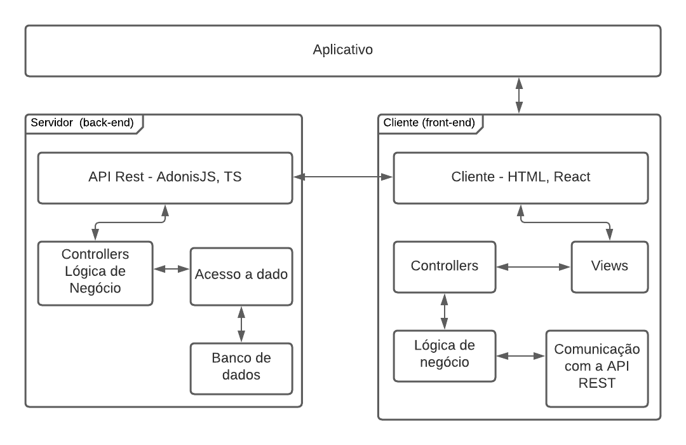
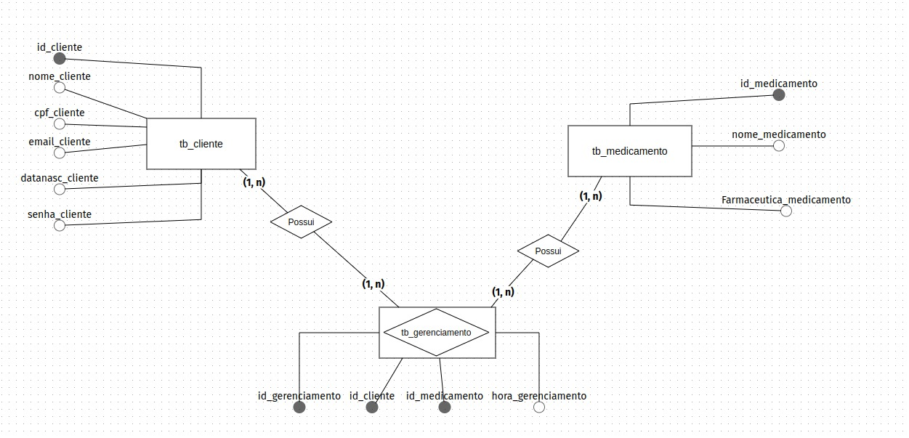

# Projeto Oficina 2

## Requisitos Funcionais
* US0001: Autenticação do usuário.
* US0002: Cadastro de usuário.
* US0003: Recuperação de usuário.
* US0004: Cadastro de medicamentos.
* US0005: Edição de medicamentos.
* US0006: Exclusão de medicamentos.
* US0007: Visualização de medicamento.
* US0008: Feed de medicamentos.
* US0009: Gerenciamento de agenda de medicamentos.

## Arquitetura

## Tecnologias
* NodeJS
* ReactJS
* AdonisJS
* PostgreSQL

## Tests
* Japa
* Jest

## Membros
* Marina Fachin
* Vinícius Lara
* Gabriel Barbosa
